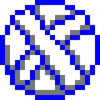
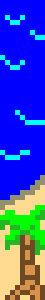
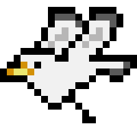
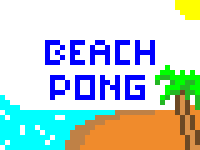
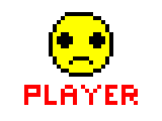
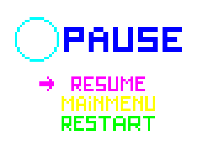

<h1 align="center"> 
   
</h1>

 
🏖️🌊🌴☀️🏐🐚🌊⛱️🦀🐬🏖️🌊🌴☀️🏐🐚🌊⛱️🦀🐬🏖️🌊🌴☀️🏐🐚🌊⛱️🦀🐬🏖️🌊🌴☀️🏐

# Sumário

- [Sobre o Projeto](#sobre-o-projeto)
- [Descrição dos Equipamentos e Software Utilizados](#equipamentos)
- [Estrutura da Placa DE1-SoC](#arq_CPU)
- [Metodologia](#metodologia)
- [Resultados e Testes](#resultados-e-testes)
- [Funcionamento do Jogo](#Funcionamento)
- [Makefile](#makefile)
- [Conclusão](#conclusao)
- [Referências](#referencia)

 
<h2> Sobre o Projeto</h2>

Este projeto representa a culminação das atividades desenvolvidas no módulo integrador TEC499 - Sistemas Digitais do curso de Engenharia de Computação da UEFS. A proposta desafia os alunos a aplicar os conhecimentos adquiridos em projetos anteriores, com destaque para a utilização de recursos como a GPU e o acelerômetro.

O Problema 3 do módulo exige a criação de um jogo que integre todas as funções previamente implementadas na biblioteca do Processador Gráfico, além de introduzir pelo menos um novo sprite na memória do sistema para ser utilizado no projeto. Este relatório documenta o desenvolvimento de um jogo Pong com uma temática praiana, onde a jogabilidade é enriquecida pela adição de um novo dispositivo de entrada/saída: o mouse.

Os requisitos principais para elaboração do sistema são apresentados a seguir:

<uL> 
  <li>Uso completo das funcionalidades da biblioteca do Processador Gráfico e a inclusão de pelo menos um novo sprite no jogo.</li>
  <li>Controle simultâneo para dois jogadores, utilizando obrigatoriamente o acelerômetro e, adicionalmente, o mouse.</li>
  <li>Interação dinâmica, onde a variação na velocidade do movimento dos dispositivos reflete diretamente na ação do ator do jogo. Por exemplo, no estilo Breakout, movimentos bruscos do mouse resultam em deslocamentos mais rápidos da barra.</li>
  <li>Exibição de informações na tela, como placar e número de vidas restantes. </li>
</ul>

Ao longo deste relatório, serão detalhadas as etapas de construção do jogo, o uso das ferramentas disponíveis, e a integração de novos elementos que destacam a criatividade e a complexidade do projeto.

<h2>  Equipe  </h2>
<uL> 
  <li><a href="https://github.com/Oguelo">Alex da Fonseca Dantas Junior</a></li>
  <li><a href="https://github.com/BRCZ1N">Bruno Campos de Oliveira Rocha</a></li>
  <li><a href="https://github.com/duasck">Luis Eduardo Leite Azevedo</a></li>
</ul>

 
<h2> Descrição dos Equipamentos e Software Utilizados</h2>

Nesta seção, são apresentados os equipamentos e software utilizados durante o desenvolvimento do projeto.

<h3>Kit de desenvolvimento DE1-SoC</h3>

A placa DE1-SoC é um kit de desenvolvimento que integra um processador ARM Cortex-A9 dual-core com um FPGA Cyclone V da Intel, proporcionando uma poderosa plataforma para projetos que combinam software e hardware. Com uma ampla variedade de periféricos, como portas VGA, Ethernet, USB, e áudio, a DE1-SoC é ideal para aplicações em sistemas embarcados e FPGA. Devido à sua versatilidade, essa placa é amplamente utilizada em ambientes educacionais e de pesquisa, facilitando o aprendizado e o desenvolvimento de projetos em ambas as áreas.
Abaixo estão os elementos utilizados na construção desse projeto:

<h3> Linguagem C</h3>
A linguagem C foi escolhida por sua eficiência, portabilidade e ampla aplicação em sistemas embarcados. Com uma sintaxe simples, ela oferece controle preciso sobre o hardware, além de contar com bibliotecas padrão e ferramentas que facilitam o desenvolvimento de código compacto e otimizado, ideal para dispositivos com recursos limitados.

<h3> Linguagem Assembly</h3>
A linguagem assembly foi escolhida por sua capacidade de oferecer controle direto sobre o hardware, permitindo o máximo de otimização e eficiência em sistemas embarcados. Com uma sintaxe próxima ao código de máquina, o assembly possibilita o uso específico de registradores e instruções, aproveitando ao máximo os recursos da arquitetura ARMv7. Essa escolha é ideal para aplicações em que desempenho e controle absoluto sobre o processamento são essenciais, especialmente em dispositivos com recursos limitados, onde o gerenciamento preciso do hardware é fundamental.

<h3> Compilador GNU</h3>

O GCC, abreviação de "GNU Compiler Collection" (Coleção de Compiladores GNU), é uma popular distribuição de compiladores que oferece suporte a diversas linguagens de programação, como C, C++, Objective-C, Fortran e Ada. Quando executado, o GCC realiza várias etapas, incluindo pré-processamento, compilação, montagem e vinculação. Ele também disponibiliza uma ampla variedade de opções de linha de comando, permitindo que o desenvolvedor personalize o processo de compilação conforme suas necessidades específicas

<h3>Visual Studio Code</h3>

O Visual Studio Code, conhecido como VSCode, é um ambiente de desenvolvimento amplamente usado. Desenvolvido pela Microsoft, é um editor de código gratuito e de código aberto com recursos como realce de sintaxe, conclusão de código e depuração integrada. Suporta várias linguagens e possui extensões para personalização. No projeto ele foi utilizado para desenvolver o código fonte do jogo.

<h3> Monitor CRT</h3>

O monitor utilizado no projeto foi o DELL M782p, um modelo de CRT que utiliza tubo de raios catódicos para exibição de imagens. Com uma tela de 17 polegadas e resolução máxima de 1280x1024 pixels, ele oferece uma interface VGA para conexão com computadores ou placas de desenvolvimento. Os monitores CRT, como o DELL M782p, são conhecidos por sua reprodução de cores vibrantes e tempos de resposta rápidos, tornando-os ideais para projetos que exigem interação em tempo real, como jogos e simulações.

Abaixo estão dados detalhados sobre o monitor usado:

|            Características            |      Detalhes      |
| :------------------------------------: | :----------------: |
|       **Tipo de Display**       |      Vertical      |
| **Tamanho da Tela (Horizontal)** |      32,4 cm      |
|  **Tamanho da Tela (Vertical)**  |      24,6 cm      |
|  **Tamanho da Tela (Diagonal)**  |      40,6 cm      |
|      **Varredura Vertical**      |    50 - 160 Hz    |
|     **Varredura Horizontal**     |    30 - 70 kHz    |
|  **Tamanho da Tela (Diagonal)**  |   43,2 cm (17")   |
|          **Dot Pitch**          |  0,270 x 0,270 mm  |
|     **Resolução Máxima**     | 1280 x 1024 pixels |
|    **Resolução do Display**    | 1024 x 768 pixels |

<h2> Estrutura da Placa DE1-SoC </h2>

Nesta parte, será detalhada a arquitetura da placa DE1-SoC, incluindo o processador ARM Cortex-A9, a organização dos registradores, o mapeamento dos dispositivos de entrada/saída na memória, o uso da memória, a comunicação entre o processador e o FPGA, além do processo de compilação nativa diretamente na placa.

<h3>Resumo dos Recursos do Processador ARM Cortex-A9 </h3>

O ARM Cortex-A9 é baseado em uma arquitetura RISC (Reduced Instruction Set Computing), onde operações aritméticas e lógicas são realizadas nos registradores de propósito geral. A movimentação de dados entre memória e registradores é feita através de instruções Load e Store, com comprimento de palavra de 32 bits e endereçamento em estilo little-endian.

<h3>Organização dos Registradores</h3>

O processador ARM Cortex-A9 contém 15 registradores de propósito geral (R0 a R14), um contador de programa (R15) e um registrador de status do programa atual (CPSR), todos com 32 bits. Dois registradores têm tratamento especial: R13 é o Stack Pointer, enquanto R14 atua como registrador de link em chamadas de sub-rotina.

<h3>Instruções e Modo Thumb</h3>

As instruções têm 32 bits e são armazenadas na memória com alinhamento de palavras. O conjunto de instruções Thumb oferece uma versão reduzida com instruções de 16 bits, o que diminui os requisitos de memória, algo útil em sistemas embarcados.

<h3>Memória Utilizada</h3>

O HPS (Hard Processor System) conta com uma interface de memória que conecta o ARM MPCORE a uma memória DDR3 de 1 GB. Esta memória serve como armazenamento de dados e programas para os processadores ARM. Organizada como 256M x 32 bits, ela pode ser acessada por palavras de 32 bits, meias palavras e bytes.

<h3>Mapeamento de Dispositivos de Entrada/Saída</h3>

Os dispositivos de E/S disponíveis ao processador ARM são mapeados diretamente na memória e acessados como se fossem endereços de memória, utilizando as instruções Load e Store.

<h3>Interrupções de Hardware</h3>

Dispositivos de E/S podem gerar interrupções de hardware, ativando as linhas de solicitação de interrupção (IRQ ou FIQ) do processador. Quando ocorre uma interrupção, o processador entra no modo de exceção correspondente e salva o estado atual do programa. Antes de retornar à execução, o endereço salvo no registrador de link deve ser decrementado em 4.

<h3>Diagrama de Blocos da Placa DE1-SoC</h3>

O sistema DE1-SoC é composto pelo HPS e pelo FPGA, ambos integrados no chip Cyclone V SoC. O HPS inclui um processador ARM Cortex-A9 dual-core, uma interface de memória DDR3 e periféricos. O FPGA implementa dois processadores Intel Nios II e vários periféricos conectados.

<h3>Compilação Nativa na DE1-SoC</h3>

A compilação nativa ocorre quando o código é compilado no mesmo sistema em que será executado. Aqui, a compilação será realizada diretamente na placa, utilizando a linha de comando do Linux e as ferramentas de compilação integradas. O comando `gcc` invoca o GNU C Compiler, um compilador de código aberto muito usado para gerar executáveis no Linux.

## Criação de assets para o jogo

Como todo jogo exige uma variedade de **assets**, o desenvolvimento de **Beach Pong** não foi diferente. Para criar esses elementos, utilizamos o software multiplataforma e web-based [Piskel](https://www.piskelapp.com/). Sua alta compatibilidade com diferentes sistemas, aliada à conveniência de acesso online, facilitou o trabalho, permitindo que os assets fossem desenvolvidos tanto remotamente, em casa, quanto no laboratório. Além disso, o Piskel oferece a opção de exportar os assets diretamente em formato **C**, tornando a integração com o jogo ainda mais eficiente.

Para incorporar os assets criados no [Piskel](https://www.piskelapp.com/) ao jogo, foram utilizadas algumas funções específicas. Uma delas é a `void renderScreen()`, que percorre o array de pixels e os desenha individualmente na tela, apagando o quadro anterior. Essa função foi essencial para a criação das animações das telas, como a inicial, a de pausa e a de game over.

Outra função semelhante foi empregada exclusivamente para carregar e sobrescrever os sprites na memória da GPU. Esse processo envolveu a leitura da sprite criada no Piskel e sua transferência para o registrador, ponto a ponto. Como cada sprite possui uma dimensão de **20x20 pixels**, foram necessários ajustes em **400 pontos** para cada nova inserção. Essas funções desempenharam um papel crucial na personalização e funcionalidade do jogo.

Podemos ver a seguir algumas artes criadas pela nossa equipe para o jogo.

Figura 1. Direção da bola após a colisão com a raquete.

Figura 2. Direção da bola após a colisão com a raquete.

Figura 3. Direção da bola após a colisão com a raquete.

Figura 4. Direção da bola após a colisão com a raquete.

Figura 5. Direção da bola após a colisão com a raquete.

Figura 6. Direção da bola após a colisão com a raquete.

Figura 7. Direção da bola após a colisão com a raquete.

Figura 8. Direção da bola após a colisão com a raquete.

Figura 8. Direção da bola após a colisão com a raquete.

## Funcionamento dos elementos do jogo 

### Movimentação da bola

A movimentação da bola no cenário foi implementada alterando suas posições horizontal e vertical de forma contínua ao longo do tempo. Isso foi feito incrementando ou decrementando essas posições a uma taxa constante, com base na direção desejada para o movimento da bola.

### Colisão 

Garantir as colisões da bola com os elementos do cenário, como paredes, blocos e a raquete, é essencial para o funcionamento do jogo. Essa funcionalidade foi implementada antecipando o movimento da bola, ou seja, verificando sua posição futura. 

Para isso, analisaram-se os pixels adjacentes à posição atual da bola. Caso algum desses pixels se sobreponha a um pixel pertencente a outro elemento do cenário, ocorre a detecção de uma colisão. Se a posição atual da bola é (x, y), verificam-se as seguintes posições: (x+1, y), (x-1, y), (x, y+1) e (x, y-1) para colisões horizontais e verticais, além das diagonais (x+1, y+1), (x-1, y+1), (x+1, y-1) e (x-1, y-1) para colisões nas bordas (Figura TAL).

  

Figura 5. Área de verificação da bola.m

Quando uma colisão é detectada, a direção do movimento da bola é invertida. Para colisões verticais, apenas o sinal da velocidade vertical é alterado; para colisões horizontais, apenas o sinal da velocidade horizontal muda. Já em colisões diagonais, ambos os sinais das velocidades horizontal e vertical são invertidos (Figura TAL).

  

Figura 6. Direção da bola após a colisão com blocos.

Para as colisões entre a bola e a raquete, um comportamento diferenciado foi implementado. A raquete é dividida em três zonas: colisões na zona esquerda fazem a bola se deslocar para a esquerda e para cima; colisões na zona central resultam em um movimento ascendente; e colisões na zona direita direcionam a bola para a direita e para cima (Figura TAL).

Figura 7. Direção da bola após a colisão com a raquete.

### Movimentação da raquete 

A movimentação das raquetes dos jogadores foi implementada utilizando dois métodos distintos, adaptados ao tipo de controle de cada um:

Jogador 1 (Acelerômetro): A raquete do primeiro jogador é controlada através do acelerômetro da placa. Valores positivos no eixo X do acelerômetro incrementam a posição da raquete, movendo-a para a direita, enquanto valores negativos decrementam, deslocando-a para a esquerda. Essa abordagem oferece uma experiência de controle baseado em movimento físico, permitindo que o jogador mova a raquete de forma intuitiva ao inclinar a placa para a esquerda ou direita.

Jogador 2 (Mouse): A raquete do segundo jogador é controlada através do movimento do mouse. A posição horizontal do mouse é monitorada, e a raquete é movida para a esquerda ou para a direita com base no movimento do cursor. A lógica para a identificação de movimentos de esquerda ou direita é implementada comparando a posição atual do mouse com a posição anterior, garantindo que a raquete se mova na direção correta.

Para ambos os jogadores, a posição das raquetes foi restringida dentro dos limites da tela. Isso garante que as raquetes permaneçam visíveis e dentro do campo de jogo, evitando que saiam da área jogável, mantendo a jogabilidade fluida e sem interrupções.

### Pausa 

O sistema de pausa, essencial para o funcionamento do jogo, utiliza a máquina de estados para realizar a transição entre o Estado de Jogo Ativo e o Estado de Menu.

Ao pressionar o botão de pausa durante a partida, o jogo é interrompido e o sistema alterna para o menu, permitindo ao jogador acessar opções como reiniciar a partida, retornar ao menu inicial ou continuar jogando. Durante essa pausa, o estado do jogo é preservado, garantindo que o jogador possa retomar exatamente de onde parou caso opte por continuar.

A lógica de pausa está integrada ao sistema de gerenciamento de estados, assegurando uma transição fluida entre o jogo e o menu, sem interrupções ou perdas no fluxo de execução.

### Sistema de Menu

O jogo conta com um sistema de menu que permite ao jogador acessar opções como reiniciar a partida, retornar ao menu inicial ou continuar no estado atual do jogo. Esse sistema é um subconjunto de estados da máquina de estados que gerencia as transições entre as diferentes partes do jogo, com base nas entradas dos botões disponíveis na placa.

A máquina de estados possui os seguintes estados principais:

Estado de Jogo Ativo: Representa o estado padrão em que o jogador está jogando. A partir deste estado, o jogador pode pausar o jogo para acessar o menu.
Estado de Menu: Exibe as opções de reinício, retorno ao menu inicial e retorno ao jogo. Dependendo do botão pressionado, a máquina de estados executa a ação correspondente.
Estado de Reinício: Reinicia a partida, retornando ao estado inicial do jogo.
Estado de Tela Inicial: Retorna à tela inicial do jogo, onde o jogador pode iniciar uma nova partida.
Estado de Retorno ao Jogo: Fecha o menu e retorna ao jogo no estado em que foi pausado.

### Vidas 

O sistema de vidas é representado por sprites que simbolizam a pontuação dos jogadores. Seguindo a temática do jogo, são utilizados sprites em formato de gaivotas (Imagem TAL), posicionados na lateral esquerda da tela principal. Cada vez que a bola atinge a parte inferior ou superior do cenário, o jogador perde uma vida, e um dos sprites é removido. Quando todas as vidas são perdidas, o jogo é encerrado, resultando na derrota do jogador.

### Testes 

Para validar o funcionamento do jogo, foram realizados testes simples. Esses testes avaliaram todas as funcionalidades implementadas, garantindo que o jogo atendesse aos requisitos e expectativas do projeto.

